# Implementation Plan: routerescalation Milestone 1 — first live labeled bracket on a real task

## Planning Verdict
- verdict: **READY_WITH_ASSUMPTIONS** (blast-radius gate resolved 2026-07-07; was BLOCKED pending sec-16 decisions)
- task_tier: **full**
- tier_trigger: Persisted dataset schema + public labels-view contract to a downstream router-training repo; switch to a hermetic pinned-SHA sandbox running an external repo's real test suite (blast-radius sensitive); live provider calls with cost. Any single one of these is a sec-16 full trigger; all three apply.
- execution_policy: cost_optimized
- model_routing: **unavailable** (this runtime has no model routing; `.killhouse/config.json` `model_tiers` are the EXPERIMENT's Fireworks placeholders, not a pipeline routing map; tier labels are documented intent only)
- model_tiers: current runtime model for all capability tiers (`fast` = `standard` = `reasoning` = current model)
- reason: The plan is fully specified and executable **offline** up to the live boundary. It halts BLOCKED on the Blast-Radius Human Gate (sec 16): three persisted-data / public-contract / testability decisions (raw-log location & keying, attempt de-dup / conflict-resolution semantics, and how a real repo's test dependencies enter the hermetic sandbox) are **not settled by the ADRs**, and each would change persisted data, the public label, or whether affected behavior can be tested at all. Per the task framing, returning BLOCKED with these decisions listed (each with a recommended low-risk default) is the correct outcome. Approve the three defaults (or override) and the plan converges to READY_WITH_ASSUMPTIONS with no code change to the plan's structure.

### Blast-Radius Decisions — RESOLVED (2026-07-07, human-approved)
The researcher approved all three recommended low-risk defaults, converging the plan to READY_WITH_ASSUMPTIONS:
- **BR-1 (raw-log location & keying):** APPROVED default — one append-only, gitignored `runs/measurements.jsonl` at the repo root, each row keyed `(task_id, tier, model_id, attempt_ordinal)`.
- **BR-2 (attempt de-dup / conflict resolution):** APPROVED default — latest attempt by `attempt_ordinal` wins; disagreeing measured attempts surface a `flaky` marker in the labels view rather than silently choosing PASS.
- **BR-3 (test-dependency provisioning):** APPROVED default — M1 is restricted to a first source repo whose suite runs on the ambient toolchain with no extra install, verified by the task spike; per-repo dependency provisioning is deferred to a later milestone.

Remaining assumptions gating only the **live** milestone (m4-live-tracer), not the offline milestones (m1/m2/m3/m5): the operational inputs HD-1 (three Fireworks model ids), HD-2 (`FIREWORKS_API_KEY`), and HD-3 (source repo + reverted commit meeting the BR-3 ambient-deps bar) must be supplied before m4 runs.

---

## Repository State (Staleness Contract)
- HEAD: `e8be841ccbd2341856820dbc0ea0ef573b64403f` (branch `main`)
- Dirty / untracked at discovery:
  - `docs/PRD.md` — **modified** (the converged PRD; the primary driver — PRESERVE)
  - `.devtribunal/REVIEW-20260707-000000.md` — untracked (superseded pass-2 review — PRESERVE, history)
  - `.devtribunal/REVIEW-20260707-002340.md` — untracked (final tribunal, risk input — PRESERVE)
  - `implementation-plan.md` — this file (new)
- Discovery timestamp: `2026-07-07T17:54:20Z`
- killhouse harness grounded at: `/home/chris/git_home/killhouse` (HEAD `f8c6af6d190e9eb22113a6bddd6b5492ff55d85c`). Do NOT plan edits to it.
- Existing user changes to preserve: the modified `docs/PRD.md` and the two `.devtribunal/*` files. No milestone may revert them.

---

## Repository Findings (Evidence Contract)

Confirmed facts (each cited):

- `py_compile` clean <- `python3 -m py_compile bin/*.py tasks/add_two/*.py` -> "py_compile OK".
- **ruff / mypy / pytest are NOT installed** <- `which pytest ruff mypy` -> all three "no X in (...)". **Consequence: no gate or test may depend on pytest/ruff/mypy without an explicit install prerequisite spike.** All tests must run under stdlib `python3` (`unittest` or plain assert scripts invoked as `python3 tests/test_*.py`).
- Python is `3.14.6` <- `python3 --version`.
- Mock loop is green <- `KILLHOUSE_ROOT=/home/chris/git_home/killhouse python3 bin/run_bracket.py --record tasks/add_two/record.json --mock` -> exit 0; `fast FAIL / standard PASS / reasoning PASS`; "minimum viable tier: standard".
- **The literal TEST_COMMAND form `bin/run_bracket.py ...` (no `python3` prefix) fails** <- same command without `python3` -> "Permission denied", exit 126. `bin/run_bracket.py` is mode `0644` (`ls -l` -> `-rw-r--r--`). **All gates in this plan invoke `python3 bin/run_bracket.py`** (or a milestone sets the executable bit; recorded as a decision, not assumed).
- killhouse importable <- `run_bracket.py:34-38` puts `$KILLHOUSE_ROOT/bin` on `sys.path` and `import killhouse_gate_replay as gr`. H1 confirmed: the runner **imports** the harness; it does **not** shell out via `--repo-root`.
- `git_worktree_sandbox(record, repo_root=ROOT)` <- `killhouse_gate_replay.py:91-108`: runs `git -C <repo_root> worktree add --detach <path> <head>`. **The worktree is of `repo_root`, and `repo_root` defaults to killhouse's own root.** For a real external-repo task, the factory must be pointed at the **task's source repo**, and `head` must be a commit in that repo. This is a required wiring detail, not a given.
- `_safe_target` (path-traversal guard) exists in killhouse <- `killhouse_gate_replay.py:120-127`; the route-logic executor omits it (H3).
- `_materialize_pinned_artifacts` / `_resolve_cwd` are underscore-private killhouse symbols the runner calls <- `run_bracket.py:72,80` (M2). `gr.dl.validate_record` is a legitimate module alias, not private (tribunal-confirmed).
- **Delegation schema `outcome.status` enum is `["pass","fail"]` only — there is NO error state** <- `schemas/delegation_record.schema.json:95`. `outcome` is required and validated <- schema `required`. **Consequence: the tri-state PASS/FAIL/ERROR MUST live in an enrichment field (schema allows `additionalProperties:true`, line 7); every persisted record must still set `outcome.status ∈ {pass,fail}` to pass validation.** ADR-0006's "PASS/FAIL/ERROR outcome" is therefore an enrichment field, not `outcome.status`.
- `.gitignore` already anticipates persisted runs <- `.gitignore` -> "runs/  # Bracket run outputs, if we start persisting them". The copy sandbox uses `ignore_errors=True` (L3) <- `run_bracket.py:57`.

Known pre-existing defects (from `.devtribunal/REVIEW-20260707-002340.md`, treated as RISK INPUTS, verified against `e8be841`): C1 (schema mismatch), H1 (false README claim), H2 (gate no timeout), H3 (executor path-traversal), M1–M7, L1–L3. These are inputs the plan must resolve, not gates themselves.

Facts sourced from the tribunal, not re-run here (flagged as review-sourced): `_is_passed(1.0)` returns True (M5); `extract_code` returns whole unfenced response (M7); locale-default encoding on write/read (M6). Executor to fix all three; the executor unit tests below re-establish their baselines at implementation time.

Unknowns requiring spikes (see Phase 0): (a) whether the researcher's chosen real repo/commit fails its suite at baseline and runs it with ambient deps; (b) exact Fireworks model ids and the API key (operational inputs, not in context).

Context docs read: PRD.md, CONTEXT.md, ADR-0001..0006, README.md, both `.devtribunal` reviews, and the three killhouse harness files. None missing.

---

## Requested Outcomes & Non-Goals

Atomic outcomes (explicit `E` / implied `I`):

- O1 (E): Unify the bracket schema — one canonical per-tier outcome field (PASS/FAIL/ERROR) that `run_bracket` writes and the labeler consumes unchanged; the minimum-viable-tier derivation lives in exactly one place (the labeler). (C1)
- O2 (I): Remove the inline label computation from `run_bracket.py:148-149`. (C1, absence)
- O3 (I): Remove `classify.py`'s dead dict-shape input; single input contract. (M4, absence)
- O4 (I): Tighten `_is_passed` to reject float `1.0`. (M5)
- O5 (E): Executor becomes multi-file whole-file (path-tagged fenced blocks, overwrite each named file). (R-EXEC / ADR-0004)
- O6 (E): Executor split ERROR semantics — model-fault (unparseable / empty fence / missing file tag) vs infra-fault (401/429/5xx/network/missing base_url), distinct exit codes; `call_model` inspects HTTP status before raising. (R-EXEC-1)
- O7 (E): On any non-PASS verdict the per-tier result carries a `diagnostics` field with the tail of gate stderr and executor stderr (captured, not discarded). (R-EXEC-2)
- O8 (E): Live mode validates non-empty `base_url` (and key) loud at startup before invoking any tier. (R-EXEC-3 — already at `run_bracket.py:129-134`; must survive the rewrite.)
- O9 (E): Executor confines the target path under the sandbox (reuse/inline `_safe_target`). (H3, absence-of-escape)
- O10 (E): Gate subprocess runs with a timeout; timeout → ERROR (infra), not FAIL. (H2)
- O11 (E): Executor pins `encoding="utf-8"` on all read/write. (M6)
- O12 (E): Hermetic `git_worktree_sandbox` pinned to the task SHA for the real task, `repo_root` = the task's source repo; copy sandbox retained only for toy smoke tests. (PRD sandbox / ADR-0003)
- O13 (E): Two-layer dataset — raw append-only JSONL of enriched delegation records (one per task×tier×attempt) + derived labels view `{task_id, minimum_viable_tier, per_tier_verdicts, tier_model_map}`, regenerable from the raw log. (ADR-0006)
- O14 (E): The tri-state ERROR is kept distinct from FAIL end-to-end: ERROR/SKIPPED = "unmeasured" and excluded from the label; only measured FAIL counts as a non-pass. (M3 / CONTEXT)
- O15 (I): Runner-to-labeler wiring covered end-to-end by a contract test (label derived from the runner's ACTUAL emitted bracket / raw-log rows, never a hand-written bracket). (M1)
- O16 (I): ERROR-split covered by a test that a model-fault records ERROR at that tier while an infra-fault is NOT recorded as a tier measurement (retried or fails loud). (R-EXEC-1 test)
- O17 (E): One real reverted-commit task prepared and pinned (committed fixture, baseline suite fails); vacuous-gate refusal if the gate already passes at baseline. (ADR-0003, PRD US8)
- O18 (E): Per-run echo of the resolved tier→model map. (PRD US25)
- O19 (I): Fix H1 — README/config `_comment` describe import (not `--repo-root` external tool). (H1, absence of the false claim)
- O20 (E): The full three-tier bracket runs one real task live across the Fireworks ladder into the hermetic sandbox, gated by the repo's own suite, emitting a two-layer row. (the milestone's headline)

Non-goals (explicit): automated task mining (M2 of project); feature extraction / router training / serving (downstream repo); cross-family tier selection; search/replace or unified-diff executor formats; decoupling the tier map from killhouse routing; parallelizing tiers (L1 remains a documented latent risk, not fixed here unless free).

---

## Facts, Assumptions, and Decisions (kept separate)

**Confirmed facts:** see Repository Findings (all cited).

**Working assumptions (low-risk, logged; would NOT change architecture/persisted-data/public-behavior):**
- A1: Tests run under stdlib `python3` (`unittest`), since pytest is absent. Gate: `python3 tests/test_*.py` / `python3 -m unittest`.
- A2: All runner gates invoke `python3 bin/run_bracket.py` (mode 0644). A milestone MAY `chmod +x`; either way the gate string is pinned.
- A3: The tri-state PASS/FAIL/ERROR is carried in an enrichment field (e.g. `re_outcome`); `outcome.status` stays `pass|fail` to satisfy schema validation. (Forced by schema.)
- A4: The runner keeps ONE code path for all three tiers (a single shared `run_gate(record, sandbox, gate)` helper), rather than "replay lower two via `gr.replay` + direct-run top." Rationale: the pass-1 runner already runs all three itself; `gr.replay` refuses `lower_tier >= chosen_tier` (`killhouse_gate_replay.py:200`), which would force a split path and re-introduce the top-tier private-symbol dependence. One path is apples-to-apples (PRD's stated goal) and simpler. M2 is resolved by upstreaming a public `run_gate` into killhouse OR vendoring small local copies of `_materialize_pinned_artifacts`/`_resolve_cwd` (executor-owned decision; low blast radius). This assumption is architectural-alignment, within planner authority.
- A5: The mock loop and copy sandbox are retained for toy smoke tests; the real task uses the git-worktree sandbox. Both coexist (no full removal).

**Decisions requiring human approval (BLAST-RADIUS — see the dedicated section; these are why the verdict is BLOCKED).**

---

## Outcome Traceability Matrix

| outcome_id | outcome (E/I) | milestone_id(s) | invariant_id(s) | final_check | baseline_verified |
| --- | --- | --- | --- | --- | --- |
| O1 | unify per-tier outcome field (E) | m2-unify-schema | inv-wiring, inv-no-inline-label | contract test + mock run | yes (mock green, C1 confirmed) |
| O2 | remove inline label (I) | m2-unify-schema | inv-no-inline-label | grep absence | yes (lines 148-149 present) |
| O3 | drop dict shape (I) | m2-unify-schema | inv-single-input | grep absence + test | yes (classify.py:68 present) |
| O4 | reject float 1.0 (I) | m2-unify-schema | inv-strict-pass | unit test | review-sourced (M5) |
| O5 | multi-file whole-file (E) | m1-executor | inv-multifile | executor unit test | n/a (new behavior) |
| O6 | split ERROR (E) | m1-executor | inv-error-split | executor unit test | n/a (new behavior) |
| O7 | diagnostics field (E) | m1-executor, m2-unify-schema | inv-diagnostics | unit test | n/a (new behavior) |
| O8 | loud base_url validation (E) | m1-executor | inv-loud-config | live-config unit test | yes (run_bracket.py:129-134) |
| O9 | sandbox path confinement (E) | m1-executor | inv-no-escape | unit test (`../` rejected) | yes (H3, no guard today) |
| O10 | gate timeout → ERROR (E) | m3-dataset | inv-gate-timeout | unit test (sleep gate) | yes (H2, no timeout today) |
| O11 | utf-8 encoding (E) | m1-executor | inv-encoding | unit test (non-ASCII) | review-sourced (M6) |
| O12 | hermetic worktree sandbox (E) | m4-live-tracer | inv-hermetic-pinned | live run + spike | partial (factory grounded) |
| O13 | two-layer dataset (E) | m3-dataset | inv-two-layer, inv-labels-contract | schema-validate + derive | n/a (new; **BR-gated**) |
| O14 | ERROR≠FAIL end-to-end (E) | m2-unify-schema, m3-dataset | inv-error-split, inv-error-unmeasured | contract test | yes (M3 confirmed) |
| O15 | wiring contract test (I) | m2-unify-schema | inv-wiring | contract test | yes (C1: NONE today) |
| O16 | ERROR-split test (I) | m1-executor | inv-error-split | executor unit test | n/a |
| O17 | real task prepared (E) | m0-task-spike | inv-baseline-fails | spike evidence + refusal | **spike (BR-gated)** |
| O18 | echo tier→model map (E) | m2-unify-schema | inv-echo-map | mock run stdout | yes (models printed today) |
| O19 | README/config truthful (I) | m5-docs | inv-no-false-claim | grep absence | yes (H1 confirmed) |
| O20 | full live bracket + row (E) | m4-live-tracer | inv-two-layer, inv-hermetic-pinned | live run | **live/BR-gated** |

No orphan milestones: every milestone below traces to ≥1 outcome. No orphan outcomes: every outcome maps to ≥1 milestone, invariant, and final check.

---

## State Transition Diagram (Mermaid)

```mermaid
stateDiagram-v2
    [*] --> Baseline
    Baseline: pass-1 scaffold\n(copy sandbox, inline label,\nverdict-string vs passed-bool schism,\nsingle-file executor, no dataset)
    Baseline --> Unified: m1-executor + m2-unify-schema\n(one outcome field, label only in labeler,\nmulti-file split-ERROR executor)
    Unified: unified schema + hardened executor\n(mock still green; copy sandbox kept for toy)
    Unified --> Persisted: m3-dataset\n(two-layer raw JSONL + labels view,\ngate timeout, offline tracer bullet)
    Persisted: two-layer dataset provable in MOCK
    Persisted --> Live: m4-live-tracer\n(git_worktree_sandbox pinned to task SHA,\nreal Fireworks ladder) [HUMAN GATE]
    Live: first live labeled bracket on a real task
    Live --> [*]: m5-docs (README/config truthful)
    note right of Live
      BLOCKED until BR-1/BR-2/BR-3 approved
      and operational inputs supplied
    end note
```



---

## Final-State Invariants

Cheap per-pass subset: `inv-mock-green`, `inv-py-compile`, `inv-no-inline-label`, `inv-wiring`, `inv-strict-pass`, `inv-error-split`, `inv-single-input`, `inv-no-false-claim`. Full suite (incl. live) at final.

```yaml
- id: inv-py-compile
  statement: All Python sources compile.
  category: regression
  check: python3 -m py_compile bin/*.py tasks/**/*.py tests/*.py
  baseline_polarity: pass (currently OK)
  post_condition: pass
  failure_reasoning: a syntax error introduced during the rewrite.
  scope: every-pass
  cost: cheap
  rationale: O1-O11
  evidence: "python3 -m py_compile bin/*.py tasks/add_two/*.py -> py_compile OK"

- id: inv-mock-green
  statement: The offline mock loop runs green and yields minimum viable tier = standard.
  category: regression
  check: python3 bin/run_bracket.py --record tasks/add_two/record.json --mock  (exit 0, prints "standard")
  baseline_polarity: pass (currently exit 0, prints standard)
  post_condition: pass
  failure_reasoning: the executor/sandbox/schema rewrite breaks the offline plumbing.
  scope: every-pass
  cost: cheap
  rationale: O20 tracer (offline)
  evidence: "python3 bin/run_bracket.py ... --mock -> exit 0, 'minimum viable tier: standard'"

- id: inv-no-inline-label
  statement: run_bracket.py computes NO minimum-viable-tier inline; derivation lives only in the labeler.
  category: absence
  check: grep -n "min_tier = next" bin/run_bracket.py  (expect no match); and run_bracket imports/uses the labeler.
  baseline_polarity: match (line 149 present today -> vacuous unless removed)
  post_condition: no match
  failure_reasoning: two label sites can drift (the C1 class of bug).
  scope: every-pass
  cost: cheap
  rationale: O2, C1
  evidence: "run_bracket.py:148-149 computes min_tier inline today"

- id: inv-wiring
  statement: Feeding run_bracket's ACTUAL emitted bracket into the labeler yields the correct label (standard for the mock), never NONE for a passing bracket.
  category: presence
  check: python3 tests/test_wiring.py  (asserts labeler(run_bracket_emitted_shape) == "standard")
  baseline_polarity: fail (today classify(run_bracket shape) -> NONE)
  post_condition: pass
  failure_reasoning: schema drift between producer and consumer (C1).
  scope: every-pass
  cost: cheap
  rationale: O1, O15
  evidence: "tribunal C1: classify(run_bracket shape) returns NONE for a passing bracket"

- id: inv-strict-pass
  statement: The PASS predicate rejects float 1.0 and non-canonical truthy values.
  category: presence
  check: python3 tests/test_classify.py  (asserts is_passed(1.0) is False, is_passed(True)/is_passed(1) True)
  baseline_polarity: fail (today _is_passed(1.0) is True)
  post_condition: pass
  failure_reasoning: a float 1.0 flips a FAIL tier to PASS, corrupting the label downward (M5).
  scope: every-pass
  cost: cheap
  rationale: O4
  evidence: "tribunal M5, verified at runtime: _is_passed(1.0) returns True"

- id: inv-single-input
  statement: The labeler accepts exactly one input shape (the canonical per-tier record list); the dict shape is gone.
  category: absence
  check: grep -n "isinstance(bracket, dict)" bin/classify.py  (expect no match)
  baseline_polarity: match (classify.py:68 present today)
  post_condition: no match
  failure_reasoning: dual shapes obscure schema mismatch (M4).
  scope: phase-end
  cost: cheap
  rationale: O3
  evidence: "classify.py:68 accepts dict shape today"

- id: inv-error-split
  statement: A model-fault (unparseable/empty/missing-tag) records ERROR at that tier; an infra-fault (401/429/5xx/network/empty base_url) is NOT recorded as a tier measurement.
  category: presence
  check: python3 tests/test_executor.py + python3 tests/test_run_bracket.py  (fake executor + fake HTTP; asserts the two exit classes map to ERROR vs retry/loud-fail distinctly)
  baseline_polarity: fail (today one non-zero exit bucket; auth failure marks every tier ERROR)
  post_condition: pass
  failure_reasoning: conflating the two lets one auth failure mislabel every tier "unmeasured" on an invalid run (R-EXEC-1).
  scope: phase-end
  cost: cheap
  rationale: O6, O14, O16
  evidence: "run_bracket.py:75-77 collapses all executor non-zero exits to ERROR"

- id: inv-diagnostics
  statement: Every non-PASS per-tier result carries a diagnostics field with gate stderr tail and executor stderr tail.
  category: presence
  check: python3 tests/test_run_bracket.py  (asserts result['diagnostics'] non-empty on FAIL and ERROR)
  baseline_polarity: fail (today results carry only a terse 'reason')
  post_condition: pass
  failure_reasoning: opaque FAIL/ERROR on a sweep is unactionable (R-EXEC-2).
  scope: phase-end
  cost: cheap
  rationale: O7
  evidence: "run_bracket.py:76-84 stores only reason strings, discards stderr"

- id: inv-loud-config
  statement: Live mode exits non-zero with a clear message if base_url or the API key is empty, before any tier runs.
  category: presence
  check: python3 tests/test_run_bracket.py  (asserts empty base_url -> SystemExit, no tier invoked)
  baseline_polarity: fail (must be re-proven under the rewrite)
  post_condition: pass
  failure_reasoning: an empty base_url silently becomes ERROR-for-all-tiers (R-EXEC-3).
  scope: phase-end
  cost: cheap
  rationale: O8
  evidence: "run_bracket.py:129-134 implements this today; the invariant guards its survival"

- id: inv-no-escape
  statement: The executor refuses a target path that escapes the sandbox (absolute or ../).
  category: presence
  check: python3 tests/test_executor.py  (RE_TARGET_FILE='../../etc/x' -> non-zero, nothing written outside)
  baseline_polarity: fail (today resolve_target does no escape check, H3)
  post_condition: pass
  failure_reasoning: a malicious/typo subdir writes outside the sandbox (H3).
  scope: phase-end
  cost: cheap
  rationale: O9
  evidence: "executor.py:70-76 has no containment check"

- id: inv-multifile
  statement: The executor applies multiple path-tagged whole-file blocks, overwriting each named file in the sandbox.
  category: presence
  check: python3 tests/test_executor.py  (two tagged blocks -> two files written)
  baseline_polarity: fail (today single RE_TARGET_FILE overwrite)
  post_condition: pass
  failure_reasoning: reverted commits span multiple files; single-file overwrite mis-applies (ADR-0003/0004).
  scope: phase-end
  cost: cheap
  rationale: O5
  evidence: "executor.py:70-99 overwrites one RE_TARGET_FILE"

- id: inv-encoding
  statement: Executor read/write pins encoding=utf-8.
  category: presence
  check: python3 tests/test_executor.py under LC_ALL=C  (non-ASCII content round-trips, no UnicodeEncodeError)
  baseline_polarity: fail (today platform-default encoding, M6)
  post_condition: pass
  failure_reasoning: C/POSIX locale -> ASCII -> non-ASCII byte crashes executor, mislabeled ERROR (M6).
  scope: phase-end
  cost: cheap
  rationale: O11
  evidence: "executor.py:94,97,99 use no explicit encoding (tribunal M6)"

- id: inv-gate-timeout
  statement: The gate subprocess has a timeout; a timeout yields ERROR (infra), not FAIL.
  category: presence
  check: python3 tests/test_run_bracket.py  (gate='sleep 999' with small timeout -> ERROR, bounded wall-clock)
  baseline_polarity: fail (today subprocess.run has no timeout, H2)
  post_condition: pass
  failure_reasoning: model-written code with an infinite loop hangs the runner forever (H2).
  scope: phase-end
  cost: cheap
  rationale: O10
  evidence: "run_bracket.py:78-82 subprocess.run has no timeout="

- id: inv-error-unmeasured
  statement: In the labels view, an ERROR/SKIPPED tier is "unmeasured" and excluded from the label; only measured FAIL is a non-pass.
  category: presence
  check: python3 tests/test_labels.py  (bracket with fast=ERROR, standard=PASS -> min tier standard, fast marked unmeasured)
  baseline_polarity: fail (today anything != PASS is treated as not-passing, M3)
  post_condition: pass
  failure_reasoning: a crashed/unmeasured tier recorded as incapable corrupts the dataset (M3, CONTEXT).
  scope: phase-end
  cost: cheap
  rationale: O14
  evidence: "run_bracket.py:148 treats != PASS as not-passing"

- id: inv-two-layer
  statement: A run appends one enriched, schema-valid delegation record per task×tier to the raw JSONL, and the labels view is regenerable from it.
  category: presence
  check: python3 tests/test_dataset.py + killhouse validate; then re-derive labels from the raw log and compare.
  baseline_polarity: fail (no dataset emitted today)
  post_condition: pass
  failure_reasoning: the milestone's deliverable (a persisted two-layer row) is absent (ADR-0006). **BR-1/BR-2 gate its layout/semantics.**
  scope: phase-end
  cost: cheap
  rationale: O13, O20
  evidence: "no runs/ output exists; .gitignore anticipates runs/"

- id: inv-labels-contract
  statement: The labels view has exactly the fields {task_id, minimum_viable_tier, per_tier_verdicts, tier_model_map}; ERROR->unmeasured, no-pass->NONE.
  category: presence
  check: python3 tests/test_labels.py  (schema-shape assertion + edge cases)
  baseline_polarity: fail (no labels view today)
  post_condition: pass
  failure_reasoning: downstream router-training repo depends on this exact contract (ADR-0006, PRD US13/14/15).
  scope: final
  cost: cheap
  rationale: O13
  evidence: "ADR-0006 fixes the field set; PRD US13/14"

- id: inv-hermetic-pinned
  statement: The real task runs in a git worktree pinned to the task's commit SHA in the task's source repo; the gate runs there.
  category: presence
  check: live run of m4-live-tracer against the prepared task (worktree HEAD == pinned SHA).
  baseline_polarity: fail (copy sandbox today, not pinned; no real task)
  post_condition: pass
  failure_reasoning: a non-hermetic or wrong-SHA sandbox makes the verdict reflect the machine, not the model (PRD). **BR-3 gates test-dep availability.**
  scope: final
  cost: expensive
  rationale: O12, O20
  evidence: "git_worktree_sandbox grounded at killhouse_gate_replay.py:91-108"

- id: inv-baseline-fails
  statement: The prepared real task's gate FAILS at baseline (reverted implementation) and is refused if it passes (vacuous-gate guard).
  category: presence
  check: run the gate on the pinned SHA before any tier -> non-zero; runner refuses on zero.
  baseline_polarity: fail (no real task exists yet -> spike)
  post_condition: pass
  failure_reasoning: a gate that passes at baseline yields a vacuous label (PRD US8, CONTEXT).
  scope: final
  cost: expensive
  rationale: O17
  evidence: "spike m0-task-spike; ADR-0003"

- id: inv-no-false-claim
  statement: README and .killhouse/config.json contain no "--repo-root / external tool" claim about killhouse invocation.
  category: absence
  check: grep -rn "repo-root\|external tool" README.md .killhouse/config.json  (expect no match)
  baseline_polarity: match (README:39-40 and config _comment assert it today)
  post_condition: no match
  failure_reasoning: the doc misrepresents the architecture (H1).
  scope: phase-end
  cost: cheap
  rationale: O19
  evidence: "README says 'invokes ... as an external tool via --repo-root'; run_bracket imports the module"
```

No invariant laundering: `inv-no-inline-label`, `inv-single-input`, `inv-no-false-claim` name exact grep targets, no allowlists.

---

## Phased Plan

### Phase 0 — Spike: prepare & validate the real task (prerequisite)
- objective: Produce a committed reverted-commit fixture whose gate fails at baseline and runs with the ambient toolchain; record the source repo, commit SHA, gate command, and baseline evidence.
- rationale: The live tracer cannot run without a real task; the task's testability (BR-3) and baseline-failing polarity (inv-baseline-fails) are unknowns that must be discovered, not guessed (sec 9).
- prerequisites: researcher supplies the source repo + candidate commit (HD-3); BR-3 policy approved.
- files/components: `tasks/<real-task>/record.json` (pins `repository_state.head` = the reverted SHA in the source repo), plus the reverted commit in the source repo.
- blast_radius: chooses which external repo/suite M1 touches (sec 16 testability trigger).
- rollback_boundary: delete the task dir + un-pin; no other file touched.
- risks: chosen suite needs unprovided deps → replan (pick another task/repo). Suite passes at baseline → refuse, pick another commit.
- exit_gate: `inv-baseline-fails` — gate on the pinned SHA exits non-zero; evidence recorded with the command.
- tracer_bullet: prerequisite (the live tracer cannot run before a real task exists).

### Phase 1 — Executor hardening (offline, no external deps)
- objective: Rewrite `bin/executor.py` to multi-file whole-file with split-ERROR semantics, diagnostics capture, path confinement, utf-8, and typed HTTP-status handling.
- rationale: O5–O11, O16; the executor is the injected seam the whole harness is tested through.
- prerequisites: none (pure offline; fully executable now).
- files/components: `bin/executor.py`, `tests/test_executor.py`.
- blast_radius: low (single provider-generic module; candidate to upstream to killhouse later).
- rollback_boundary: revert `bin/executor.py` + its test.
- risks: exit-code contract must be agreed with the runner (define constants: e.g. `EXIT_MODEL_FAULT`, `EXIT_INFRA_FAULT`).
- exit_gate: `inv-multifile`, `inv-error-split`, `inv-no-escape`, `inv-encoding`, `inv-loud-config` (config half in runner) green under `python3 tests/test_executor.py`.

#### Milestone: m1-executor
- outcome: `bin/executor.py` applies N path-tagged whole-file blocks, confines each target under the sandbox, uses utf-8, and exits with distinct codes for model-fault vs infra-fault (with `call_model` inspecting HTTP status before raising and emitting stderr diagnostics).
- traces_to: O5, O6, O7, O9, O11, O16
- implementation_scope: `bin/executor.py`, `tests/test_executor.py`. Private helpers (fence parsing, path-tag parsing) allowed within the module.
- dependencies: none.
- tracer_bullet: no (component prerequisite of the offline tracer).
- implementation_contracts:
  - path: `bin/executor.py` · responsibility: prompt+model → candidate multi-file change applied in the sandbox, with typed failure signaling · contract_depth: **detailed**
  - public surface: `extract_files(text) -> dict[path,str]` (parse path-tagged fenced blocks; raise on none/empty/missing-tag → model-fault); `call_model(model, prompt) -> str` (inspect HTTP status; 401/429/5xx/URLError/KeyError → infra-fault); `resolve_target(workdir, rel)` (reuse/inline killhouse `_safe_target`; reject abs/`..`); `main()` maps model-fault→`EXIT_MODEL_FAULT`, infra-fault→`EXIT_INFRA_FAULT`, prints diagnostics to stderr.
  - invariants: never write outside the sandbox; never silently swallow a non-ASCII byte; the two fault classes never share an exit code.
  - gates: `inv-multifile`, `inv-error-split`, `inv-no-escape`, `inv-encoding`.
  - forbidden edits: no diff/patch parsing (ADR-0004 defers it); no network in tests.
  - contract_review: standard tier (provider-generic module, low risk) — escalate to reasoning only if the HTTP-status taxonomy is contested.
- subagent_work: role Test/Gate + implementer; tier standard (mechanical, well-specified); delegate yes; policy_rationale cost_optimized — bounded module + tests; escalation_trigger repeated exit-code contract failure → reasoning; inputs this contract + R-EXEC-1/2; required output the module + `tests/test_executor.py` green.
- acceptance_gates:
  - `python3 -m py_compile bin/executor.py` → OK. baseline: pass. post: pass.
  - `python3 tests/test_executor.py` → OK. baseline: fail (tests new; today's executor has H3/M6/M7 gaps). post: pass.
- gate_failure_reasoning: an executor that can't split faults or confine paths corrupts labels / escapes the sandbox.
- invariants_at_risk: inv-error-split, inv-no-escape, inv-multifile, inv-encoding.
- evidence_to_record: the exit-code constants; test output.
- rollback_unit: `bin/executor.py` + `tests/test_executor.py`.
- stop_conditions: if killhouse `_safe_target` is not importable, inline a vendored copy (record it).

### Phase 2 — Unify the bracket schema and wire runner→labeler (offline)
- objective: One canonical per-tier outcome record the runner writes and the labeler consumes; delete the inline label; strict PASS predicate; single input shape; diagnostics + the executor's exit-code split threaded into results; ERROR/SKIPPED = unmeasured.
- rationale: O1–O4, O7, O14, O15, O18; resolves C1/M3/M4/M5.
- prerequisites: m1-executor (exit-code contract).
- files/components: `bin/run_bracket.py`, `bin/classify.py`, `tests/test_classify.py`, `tests/test_wiring.py`, `tests/test_run_bracket.py`.
- blast_radius: medium (defines the internal bracket record that the dataset layer serializes).
- rollback_boundary: revert the three modules + their tests.
- risks: the canonical field name (`status`/`re_outcome`) must match what the dataset layer persists (A3).
- exit_gate: `inv-wiring`, `inv-no-inline-label`, `inv-strict-pass`, `inv-single-input`, `inv-error-split`, `inv-diagnostics`, `inv-mock-green` green.

#### Milestone: m2-unify-schema
- outcome: `run_bracket.py` emits a list of per-tier records each carrying one canonical tri-state outcome field + `diagnostics`, imports the labeler, and prints the label from `classify.minimum_viable_tier(results)`; `classify.py` reads that field, rejects float 1.0, accepts one shape, and treats ERROR/SKIPPED as unmeasured. `python3 bin/run_bracket.py --mock` still prints `standard`; a contract test feeds the emitted shape into the labeler.
- traces_to: O1, O2, O3, O4, O7, O14, O15, O18
- implementation_scope: `bin/run_bracket.py`, `bin/classify.py`, plus tests. A shared `run_gate(record, sandbox, gate)` helper (A4) that both the single code path and the dataset layer call.
- dependencies: m1-executor.
- tracer_bullet: no (the offline dataset tracer is m3; this is its wiring prerequisite).
- implementation_contracts:
  - path: `bin/run_bracket.py` · responsibility: run all three tiers through ONE shared sandbox+executor+gate helper; map executor exit codes to tri-state (model-fault→ERROR, infra-fault→retry/loud-fail, gate exit→PASS/FAIL, timeout→ERROR); emit list of records; echo tier→model map; print label via labeler · contract_depth: **detailed**
  - public surface: `run_tier(...) -> dict` (adds canonical outcome field + `diagnostics`); `run_gate(record, sandbox, gate) -> (exit, stderr_tail)`; `main()` prints `classify.minimum_viable_tier(results)`; **remove** the inline `min_tier = next(...)`.
  - invariants: exactly one label site; infra-fault is never recorded as a tier measurement; `run_gate` passes a timeout (wired in m3).
  - forbidden edits: no second label computation; no dict-shape reintroduction.
  - contract_review: reasoning tier for the outcome-field naming (public-contract-adjacent: the dataset layer serializes it); standard for the rest.
  - path: `bin/classify.py` · responsibility: pure reducer bracket→label over one canonical shape; strict PASS; ERROR/SKIPPED unmeasured · contract_depth: **detailed** · gates: inv-strict-pass, inv-single-input, inv-error-unmeasured, inv-wiring.
- subagent_work: role implementer + Test/Gate; tier standard for classify, reasoning for the outcome-field contract; delegate yes; escalation_trigger contract ambiguity between runner emit and dataset persist → reasoning.
- acceptance_gates:
  - `python3 bin/run_bracket.py --record tasks/add_two/record.json --mock` → exit 0, prints `standard`. baseline: pass. post: pass. (inv-mock-green)
  - `python3 tests/test_wiring.py` → labeler(emitted shape)=="standard". baseline: **fail** (today NONE). post: pass.
  - `python3 tests/test_classify.py` → is_passed(1.0) False; dict shape rejected. baseline: fail. post: pass.
  - `grep -n "min_tier = next" bin/run_bracket.py` → no match. baseline: match. post: no match.
- gate_failure_reasoning: silent NONE-for-passing-bracket (C1) or float-1.0 flip (M5).
- invariants_at_risk: inv-wiring, inv-no-inline-label, inv-strict-pass, inv-single-input.
- evidence_to_record: the canonical outcome field name; test output.
- rollback_unit: the three modules + tests.
- stop_conditions: if the outcome-field name can't be reconciled with the dataset layer, escalate to replan (do not fork the field).

### Phase 3 — Two-layer dataset + gate timeout (offline tracer bullet)
- objective: Persist one enriched, schema-valid delegation record per task×tier to the raw JSONL, and derive the labels view from it; add the gate timeout. Prove the whole path in MOCK.
- rationale: O10, O13, O20 (offline half); ADR-0006. **This is the offline tracer bullet: a thin, runnable, end-to-end slice (record → sandbox → executor → gate → raw row → labels view) provable with `--mock`, no network, no external repo.**
- prerequisites: m2-unify-schema; **BR-1 and BR-2 approved** (raw-log location/keying and de-dup semantics).
- files/components: `bin/run_bracket.py` (writer + timeout), a labeler/deriver (`bin/classify.py` or a new `bin/derive_labels.py`), two schema files (raw enrichment + labels view), `tests/test_dataset.py`, `tests/test_labels.py`.
- blast_radius: **high** — persisted data + public labels-view contract (sec 16). Gated on BR-1/BR-2.
- rollback_boundary: revert the writer/deriver + schemas + tests; delete `runs/` output.
- risks: the tri-state must be enrichment (A3); `outcome.status` must stay pass|fail for validation.
- exit_gate: `inv-two-layer`, `inv-labels-contract`, `inv-error-unmeasured`, `inv-gate-timeout` green in mock.
- tracer_bullet: **yes** (offline end-to-end slice from the highest practical seam).

#### Milestone: m3-dataset
- outcome: `run_bracket.py --mock` appends 3 enriched delegation records (each validating against killhouse's schema, tri-state in an enrichment field, `outcome.status∈{pass,fail}`) to the raw JSONL at the BR-1 location, and emits a labels-view row `{task_id, minimum_viable_tier: standard, per_tier_verdicts, tier_model_map}` derived from the raw log; the gate runs with a timeout (timeout→ERROR).
- traces_to: O10, O13, O14, O20
- implementation_scope: writer + deriver + two schema files + tests.
- dependencies: m2-unify-schema; BR-1, BR-2.
- tracer_bullet: yes.
- implementation_contracts:
  - path: raw-record enrichment schema (new file, e.g. `schemas/raw_enrichment.schema.json`) · responsibility: the additionalProperties fields (`task_id`, `model_id`, latency, tokens, tri-state `re_outcome`, `attempt`) · contract_depth: detailed.
  - path: labels-view schema (new file, e.g. `schemas/labels_view.schema.json`) · responsibility: `{task_id, minimum_viable_tier, per_tier_verdicts, tier_model_map}` · contract_depth: detailed (public contract — reasoning-tier review).
  - path: dataset writer in `bin/run_bracket.py` · responsibility: append one enriched record per tier, keyed per BR-1; validate each with `gr.dl.validate_record` before write · contract_depth: detailed · invariants: append-only; every written record schema-valid; de-dup at derive time per BR-2.
  - path: label deriver · responsibility: read raw log, de-dup per BR-2, emit labels view · contract_depth: detailed.
  - gates: inv-two-layer, inv-labels-contract, inv-error-unmeasured, inv-gate-timeout.
- subagent_work: role implementer + Test/Gate; tier reasoning for the two schemas (public contract) + standard for the writer; delegate yes; escalation_trigger schema-shape disagreement → reasoning; required output green `tests/test_dataset.py`, `tests/test_labels.py`, and a schema-valid raw log in mock.
- acceptance_gates:
  - `python3 bin/run_bracket.py --record tasks/add_two/record.json --mock` then validate the raw log: each record passes `killhouse_delegation_log.py --validate` (or `gr.dl.validate_record`). baseline: fail (no log). post: pass.
  - re-derive labels from the raw log → equals the emitted labels view (regenerable). baseline: fail. post: pass.
  - `python3 tests/test_run_bracket.py` timeout case (`sleep`-style gate) → ERROR, bounded wall-clock. baseline: fail. post: pass.
- gate_failure_reasoning: a non-regenerable or schema-invalid dataset breaks the downstream contract.
- invariants_at_risk: inv-two-layer, inv-labels-contract, inv-gate-timeout.
- evidence_to_record: a sample raw record + labels row (mock); the de-dup rule applied (BR-2).
- rollback_unit: writer/deriver + schemas + tests.
- stop_conditions: BR-1/BR-2 not approved → do not implement persistence; halt.

### Phase 4 — Live tracer bullet: first real labeled bracket [HUMAN GATE]
- objective: Swap in `git_worktree_sandbox` pinned to the task SHA (repo_root = the task's source repo), run the real task across the live Fireworks ladder, gate with the repo's suite, emit the two-layer row.
- rationale: O12, O20; the milestone's headline.
- prerequisites: m0-task-spike (real task), m3-dataset (offline path green), **BR-3 approved**, operational inputs HD-1/HD-2/HD-3 supplied and validated.
- files/components: `bin/run_bracket.py` (sandbox-factory selection: copy for toy, git-worktree for real), `.killhouse/config.json` (real model ids).
- blast_radius: **highest** — live provider spend + external-repo suite execution + first persisted real row (sec 16 all-triggers). **Human-confirmation checkpoint required before the first live call.**
- rollback_boundary: revert the factory-selection change; the raw log is append-only (a bad row is superseded, not mutated).
- risks: infra-fault storm (bad key) → R-EXEC-1 makes the run fail loud, not mislabel; suite needs unprovided deps → BR-3 replan.
- exit_gate: `inv-hermetic-pinned`, `inv-baseline-fails`, `inv-two-layer` on the real task; a real labels row with a defined minimum_viable_tier (or NONE) and ERROR-distinct-from-FAIL.
- tracer_bullet: yes (the live end-to-end slice).

#### Milestone: m4-live-tracer
- outcome: One real reverted-commit task runs across fast/standard/reasoning live on Fireworks in a worktree pinned to the task SHA; the repo's suite gates each; a two-layer row is persisted with ERROR kept distinct from FAIL.
- traces_to: O12, O20
- implementation_scope: sandbox-factory selection in `run_bracket.py`; config model ids (operational).
- dependencies: m0-task-spike, m3-dataset, BR-3, HD-1/2/3.
- tracer_bullet: yes.
- subagent_work: role reasoning (live-run supervision + safety); delegate no — tightly coupled to the human checkpoint and live spend; policy_rationale a live-spend, first-real-write step is not safe to delegate to a cheap tier; escalation_trigger any infra-fault → stop, fix config, retry.
- acceptance_gates:
  - worktree HEAD == pinned SHA (inv-hermetic-pinned); gate on pinned SHA fails at baseline (inv-baseline-fails).
  - live run emits a schema-valid raw row per tier + a labels row; an ERRORed tier is unmeasured, not FAIL.
- gate_failure_reasoning: a wrong-SHA/non-hermetic sandbox measures the machine, not the model.
- invariants_at_risk: inv-hermetic-pinned, inv-baseline-fails, inv-two-layer.
- evidence_to_record: worktree SHA; the resolved tier→model echo; the persisted row.
- rollback_unit: factory-selection change; append-only log (no mutation).
- stop_conditions: infra-fault, gate needs unprovided deps, or vacuous gate → halt/replan.

### Phase 5 — Docs truth-up
- objective: Fix H1 — README and config `_comment` describe import, not `--repo-root` external tool.
- rationale: O19.
- prerequisites: none (can run any time).
- files/components: `README.md`, `.killhouse/config.json`.
- rollback_boundary: revert the two doc edits.
- exit_gate: `inv-no-false-claim`.

#### Milestone: m5-docs
- outcome: No "--repo-root / external tool" claim survives; both say the runner imports `killhouse_gate_replay` as a module.
- traces_to: O19
- acceptance_gates: `grep -rn "repo-root\|external tool" README.md .killhouse/config.json` → no match. baseline: match. post: no match.

---

## Subagent Matrix

| Work item | Role | Tier | Delegate? | Policy rationale | Escalation trigger | Inputs | Required output |
| --- | --- | --- | --- | --- | --- | --- | --- |
| Task-prep spike | Scout | standard | yes | mechanical discovery + baseline evidence | suite needs deps / passes at baseline | source repo + candidate commit | committed fixture + baseline-fails evidence |
| Executor rewrite | Impl+Test | standard | yes | bounded provider-generic module | exit-code taxonomy contested | R-EXEC-1/2, ADR-0004 | executor.py + test_executor.py green |
| Schema unification | Impl+Test | standard (reasoning for outcome-field name) | yes | reversible, well-specified; naming is contract-adjacent | runner/dataset field mismatch | C1/M3/M4/M5 | run_bracket+classify+tests green |
| Two schemas (raw + labels) | Test/Gate | reasoning | yes | public contract to downstream repo | shape disagreement | ADR-0006, PRD US13/14 | two schema files + validators |
| Dataset writer/deriver | Impl+Test | standard | yes | mechanical once schema fixed | de-dup semantics unclear (BR-2) | BR-1/BR-2 | writer+deriver+tests green |
| Live tracer supervision | Lead | reasoning | **no** | live spend + first real write; safety-critical | any infra-fault | HD-1/2/3, BR-3 | one real two-layer row |
| Docs truth-up | Impl | fast | yes | localized text | — | H1 | README+config truthful |
| Gate audit | Gate Auditor | reasoning (inline persona) | no (no fresh instance) | runtime lacks nested subagents | — | this plan | audit findings (below) |

---

## Consolidated Verification
Proves, at final: (1) new behavior works — offline mock emits a two-layer row with min tier `standard` and the live tracer emits one real labeled row; (2) obsolete state gone — no inline label site, no dict-shape input, no false killhouse claim (grep absences); (3) affected tests pass — `python3 -m unittest` over `tests/` (no pytest); (4) unrelated behavior not regressed — `inv-mock-green`, `inv-py-compile`; (5) docs/config/terminology reflect only the intended final state (H1 fixed; ERROR≠FAIL honored in code and labels view). Cheap per-pass subset runs every pass; expensive/live invariants run at final.

---

## Replan Triggers
- The prepared task's suite needs deps not available in the ambient toolchain (BR-3 default violated) → pick another task/repo.
- The task's gate passes at baseline (vacuous) → pick another commit.
- killhouse `_safe_target` / private helpers not importable at `$KILLHOUSE_ROOT` → vendor local copies (record it).
- The killhouse schema stops allowing `additionalProperties` → the enrichment strategy (A3) breaks; re-plan the raw layer.
- Any infra-fault during the live run (401/429/5xx/empty base_url) → stop, fix config, retry; never record it as a tier measurement.
- Staleness: any file cited above changed since HEAD `e8be841` → re-run its citation before executing.

---

## Downstream Handoff (for PLAN_EXECUTE_LOOP)
- **Run the Staleness Contract check first:** verify HEAD == `e8be841ccbd2341856820dbc0ea0ef573b64403f`, dirty list == `{docs/PRD.md (M), .devtribunal/*.md (??)}`; if any cited file (`bin/*.py`, `tasks/add_two/record.json`, killhouse harness, schema) changed, re-run its citation before executing.
- **Ordered milestones:** m0-task-spike → m1-executor → m2-unify-schema → m3-dataset(BR-1,BR-2) → m4-live-tracer(BR-3,HD-1/2/3)[HUMAN GATE] → m5-docs. m1/m2/m3/m5 are fully offline and executable now; m0 needs a source repo; m4 needs the blast-radius approvals + operational inputs.
- **Invariant suite:** cheap per-pass subset = {inv-py-compile, inv-mock-green, inv-no-inline-label, inv-wiring, inv-strict-pass, inv-error-split, inv-single-input, inv-no-false-claim}; phase-end = the rest; expensive/live (inv-hermetic-pinned, inv-baseline-fails) at final.
- **Human-confirmation points:** before m3-dataset persistence (BR-1/BR-2) and before the first live call in m4 (BR-3 + operational inputs). Do not persist or spend before approval.
- **File contracts:** as in each milestone above; private helpers within an already-contracted module are allowed and recorded by the executor. A new production file, a change to the raw/labels schema field set, or an edit outside `implementation_scope` requires a contract update or replan. Reasoning-tier code-writing exception: only the live-tracer supervision (m4) and the two public schema files.

---

## BLAST-RADIUS DECISIONS (why the verdict is BLOCKED — sec 16)

Each is a persisted-data / public-contract / testability decision **not settled by the ADRs**; each carries a recommended low-risk default so approval is fast.

- **BR-1 — Raw measurement log location & keying granularity.** ADR-0006 fixes the two-layer *structure* but not *where the raw log lives* or its *key*. Options: single global gitignored JSONL vs per-repo/per-task files; key tuple. *Recommended default:* one global append-only `runs/measurements.jsonl` (gitignored; `.gitignore` already anticipates `runs/`), keyed `(task_id, tier, model_id, attempt_ordinal)`. *Why it needs a human:* it is persisted-data layout a downstream repo reads.
- **BR-2 — Attempt de-dup / conflict-resolution semantics for the labels view.** ADR-0006 is silent; PRD OQ3 assigns it to PLAN. When multiple *measured* attempts of the same (task, tier) exist and disagree (PASS vs FAIL), which defines the tier's verdict? This directly determines the public minimum-viable-tier label. *Recommended default:* latest-attempt-wins by `attempt_ordinal`; a disagreement among measured attempts surfaces an explicit `flaky` marker rather than silently choosing PASS (fail-safe for label trust). *Why it needs a human:* it changes persisted data + public label determinism.
- **BR-3 — How a real repo's test dependencies enter the hermetic `git_worktree_sandbox`.** PRD OQ1 (material); ADR-0003 leaves it as per-repo onboarding cost. Options: rely on the ambient environment; provision per-repo; or restrict M1 to a suite that runs with no extra setup. *Recommended default:* restrict M1 to a task whose suite runs on the ambient toolchain with no provisioning (PRD option 3), verified by m0-task-spike; point the sandbox `repo_root` at the task's *source repo* (not route-logic). *Why it needs a human:* it is the sec-16 "adequate way to test affected behavior" trigger and constrains which external repo M1 executes.

## HUMAN DECISIONS REQUIRED
- Approve (or override) BR-1, BR-2, BR-3 above.
- Supply operational inputs before m4 (live): HD-1 three concrete Fireworks model ids (single family, ascending) into `.killhouse/config.json`; HD-2 `FIREWORKS_API_KEY` in the environment; HD-3 the source repo + reverted commit for the first real task, confirmed to fail its suite at baseline and run it with ambient deps (the BR-3 bar).

Once BR-1/BR-2/BR-3 are approved, no structural change to this plan is required and the verdict converges to READY_WITH_ASSUMPTIONS (executable offline through m3 immediately; m4 gated on the operational inputs).

---

## Review Record

Reviewer lenses run as labeled inline passes (no nested subagents; findings kept raw and sequential per sec 3/19):

- **GateQuality:** every gate has a proven or recorded failing baseline; the literal `bin/run_bracket.py` exit-126 trap is disclosed and all gates use `python3 bin/...`. Accepted: pin `python3` prefix in every gate string.
- **Completeness:** all 14 tribunal findings mapped to outcomes/invariants (C1→inv-wiring/inv-no-inline-label; H1→inv-no-false-claim; H2→inv-gate-timeout; H3→inv-no-escape; M1→tests; M2→A4/vendor; M3→inv-error-unmeasured; M4→inv-single-input; M5→inv-strict-pass; M6→inv-encoding; M7→inv-error-split; L1/L2/L3 disclosed as latent, L2 subsumed by R-EXEC-1). Accepted.
- **Migration/Removal:** copy sandbox retained for toy (not a full removal); absence invariants cover the inline label, dict shape, and false doc claim — all non-vacuous (grep matches at baseline). Characterization-before-deletion: the removed inline label is replaced by the labeler with a contract test proving equivalence (inv-wiring) — satisfied.
- **Sequencing:** offline tracer (m3) precedes the live tracer (m4); m1/m2 are prerequisites; the first non-spike milestone (m3) is a runnable end-to-end slice from the highest practical seam — satisfies the tracer-bullet rule. m0 is a named spike prerequisite.
- **Risk & Rollback:** append-only log means a bad live row is superseded, not mutated; every phase has a concrete rollback unit; unrelated work (PRD.md, reviews) preserved.
- **RepositoryAlignment:** the schema constraint (outcome.status has no error state) is honored via enrichment (A3); one code path (A4) aligns with the pass-1 runner rather than forcing the replay/direct split. Accepted.
- **Simplification (Ponytail):** rejected adding a search/replace executor (ADR-0004 defers); rejected fixing L1 (tier parallelism) now (non-goal); kept the single-code-path over replay-split (fewer moving parts). One narrow gate per invariant, no ceremonial suite. Conflict: Simplification wanted to drop the `flaky` marker in BR-2; **overruled by Safety/label-trust (sec 11.1 priority 1 > 5)** — winner_lens RiskRollback, loser_lens Simplification.

**Falsification (inline):**
- Cold-start walk: a fresh agent hits the first guess at BR-1/BR-2/BR-3 (raw-log layout, de-dup, test-deps) — these are exactly the human-gated decisions, so the plan correctly halts rather than letting the executor guess. Second potential guess: the canonical outcome-field name — pinned in m2's contract (reasoning-tier review) to match the dataset layer. No un-gated cold-start gap on a delivered outcome.
- Pre-mortem: (a) auth failure mislabels all tiers → prevented by R-EXEC-1 infra-fault split (inv-error-split); (b) gate hangs on model code → inv-gate-timeout; (c) non-regenerable dataset → inv-two-layer re-derive check; (d) wrong-SHA sandbox → inv-hermetic-pinned; (e) float-1.0 label flip → inv-strict-pass; (f) staleness → Staleness Contract check in handoff.

**Adversarial Gate Audit (inline, fresh-auditor persona; `gate_audit: inline` — no fresh instance available, prior justifications disregarded):**
- inv-no-inline-label / inv-single-input / inv-no-false-claim: non-vacuous — grep matches at baseline (cited). Pass.
- inv-wiring / inv-strict-pass / inv-error-split: baseline proven failing by tribunal evidence (C1 NONE, M5 True, R-EXEC-1 collapse). Pass.
- inv-two-layer / inv-labels-contract: baseline failing (no dataset today). Audit flag: their *semantics* depend on BR-1/BR-2 — correctly surfaced as blast-radius, not asserted. Pass (as gated).
- inv-hermetic-pinned / inv-baseline-fails: expensive/live; baseline failing (no real task). Could they pass while the outcome is unmet? Only if the worktree SHA check is skipped — the gate names the exact check (HEAD==pinned SHA). Pass.
- No gate found vacuous. No gate can pass while its traced outcome is unmet.

**Convergence:** Pass 1 draft → inline review/falsify/audit → Pass 2 revisions (pin `python3` in gates; add inv-diagnostics; make A4 explicit; add the `flaky` marker to BR-2 over Simplification). No finding regressed or thrashed. Halt cause: Blast-Radius Human Gate (sec 16), not thrash. Open findings are the three human decisions (intended), plus latent L1 (disclosed non-goal). No open Blocking/Material *code* findings.

```json
{
  "verdict": "READY_WITH_ASSUMPTIONS",
  "blast_radius_gate": "resolved 2026-07-07: BR-1, BR-2, BR-3 all approved at recommended defaults (was BLOCKED)",
  "task_tier": "full",
  "tier_trigger": "Persisted dataset schema + public labels-view contract to a downstream repo; hermetic pinned-SHA sandbox running an external repo's real suite; live provider spend. Any one is a sec-16 full trigger.",
  "execution_policy": "cost_optimized",
  "model_routing": "unavailable",
  "model_tiers": { "fast": "current-model", "standard": "current-model", "reasoning": "current-model" },
  "passes": 2,
  "open_blocking_findings": 0,
  "open_material_findings": 0,
  "vacuous_gates_found": 0,
  "cold_start_gaps": 0,
  "uncited_facts": 0,
  "gate_audit": "inline",
  "staleness": { "head": "e8be841ccbd2341856820dbc0ea0ef573b64403f", "dirty_files": ["docs/PRD.md", ".devtribunal/REVIEW-20260707-000000.md", ".devtribunal/REVIEW-20260707-002340.md"], "discovered_at": "2026-07-07T17:54:20Z" },
  "traceability_complete": true,
  "orphan_milestones": [],
  "characterization_gaps": [],
  "conflicts_resolved": [ { "id": "BR-2-flaky-marker", "winner_lens": "RiskRollback", "loser_lens": "Simplification" } ],
  "invariants": [
    { "id": "inv-mock-green", "category": "regression", "scope": "every-pass", "cost": "cheap", "check": "python3 bin/run_bracket.py --record tasks/add_two/record.json --mock (exit 0, 'standard')", "baseline_polarity": "pass", "evidence": "mock run -> exit 0, minimum viable tier: standard" },
    { "id": "inv-no-inline-label", "category": "absence", "scope": "every-pass", "cost": "cheap", "check": "grep -n 'min_tier = next' bin/run_bracket.py -> no match", "baseline_polarity": "match", "evidence": "run_bracket.py:148-149 computes min_tier inline" },
    { "id": "inv-wiring", "category": "presence", "scope": "every-pass", "cost": "cheap", "check": "python3 tests/test_wiring.py (labeler(emitted)=='standard')", "baseline_polarity": "fail", "evidence": "C1: classify(run_bracket shape) -> NONE" },
    { "id": "inv-strict-pass", "category": "presence", "scope": "every-pass", "cost": "cheap", "check": "python3 tests/test_classify.py (is_passed(1.0) False)", "baseline_polarity": "fail", "evidence": "M5: _is_passed(1.0) returns True" },
    { "id": "inv-single-input", "category": "absence", "scope": "phase-end", "cost": "cheap", "check": "grep -n 'isinstance(bracket, dict)' bin/classify.py -> no match", "baseline_polarity": "match", "evidence": "classify.py:68 accepts dict shape" },
    { "id": "inv-error-split", "category": "presence", "scope": "phase-end", "cost": "cheap", "check": "python3 tests/test_executor.py + test_run_bracket.py", "baseline_polarity": "fail", "evidence": "run_bracket.py:75-77 collapses executor exits to ERROR" },
    { "id": "inv-diagnostics", "category": "presence", "scope": "phase-end", "cost": "cheap", "check": "python3 tests/test_run_bracket.py (diagnostics non-empty on non-PASS)", "baseline_polarity": "fail", "evidence": "run_bracket.py discards stderr" },
    { "id": "inv-loud-config", "category": "presence", "scope": "phase-end", "cost": "cheap", "check": "python3 tests/test_run_bracket.py (empty base_url -> SystemExit)", "baseline_polarity": "fail", "evidence": "run_bracket.py:129-134 implements it; invariant guards survival" },
    { "id": "inv-no-escape", "category": "presence", "scope": "phase-end", "cost": "cheap", "check": "python3 tests/test_executor.py (../ rejected)", "baseline_polarity": "fail", "evidence": "H3: executor.py:70-76 no containment check" },
    { "id": "inv-multifile", "category": "presence", "scope": "phase-end", "cost": "cheap", "check": "python3 tests/test_executor.py (2 tagged blocks -> 2 files)", "baseline_polarity": "fail", "evidence": "executor.py overwrites one RE_TARGET_FILE" },
    { "id": "inv-encoding", "category": "presence", "scope": "phase-end", "cost": "cheap", "check": "python3 tests/test_executor.py under LC_ALL=C", "baseline_polarity": "fail", "evidence": "M6: no explicit encoding" },
    { "id": "inv-gate-timeout", "category": "presence", "scope": "phase-end", "cost": "cheap", "check": "python3 tests/test_run_bracket.py (sleep gate -> ERROR)", "baseline_polarity": "fail", "evidence": "H2: run_bracket.py:78 no timeout" },
    { "id": "inv-error-unmeasured", "category": "presence", "scope": "phase-end", "cost": "cheap", "check": "python3 tests/test_labels.py (ERROR tier excluded from label)", "baseline_polarity": "fail", "evidence": "M3: != PASS treated as not-passing" },
    { "id": "inv-two-layer", "category": "presence", "scope": "phase-end", "cost": "cheap", "check": "validate raw log + re-derive labels", "baseline_polarity": "fail", "evidence": "no dataset emitted today (BR-1/BR-2 gated)" },
    { "id": "inv-labels-contract", "category": "presence", "scope": "final", "cost": "cheap", "check": "python3 tests/test_labels.py (field-set + edge cases)", "baseline_polarity": "fail", "evidence": "ADR-0006 field set; no labels view today" },
    { "id": "inv-hermetic-pinned", "category": "presence", "scope": "final", "cost": "expensive", "check": "live run: worktree HEAD == pinned SHA", "baseline_polarity": "fail", "evidence": "copy sandbox today (BR-3 gated)" },
    { "id": "inv-baseline-fails", "category": "presence", "scope": "final", "cost": "expensive", "check": "gate on pinned SHA -> non-zero; refuse on zero", "baseline_polarity": "fail", "evidence": "spike m0-task-spike; ADR-0003" },
    { "id": "inv-no-false-claim", "category": "absence", "scope": "phase-end", "cost": "cheap", "check": "grep -rn 'repo-root|external tool' README.md .killhouse/config.json -> no match", "baseline_polarity": "match", "evidence": "H1: README:39-40 + config _comment assert it" },
    { "id": "inv-py-compile", "category": "regression", "scope": "every-pass", "cost": "cheap", "check": "python3 -m py_compile bin/*.py tasks/**/*.py tests/*.py", "baseline_polarity": "pass", "evidence": "py_compile OK today" }
  ],
  "cheap_every_pass_invariants": ["inv-py-compile", "inv-mock-green", "inv-no-inline-label", "inv-wiring", "inv-strict-pass", "inv-error-split", "inv-single-input", "inv-no-false-claim"],
  "blast_radius_decisions": [
    "BR-1: raw measurement log location & keying — default: global gitignored runs/measurements.jsonl keyed (task_id,tier,model_id,attempt_ordinal). Persisted-data layout read downstream.",
    "BR-2: attempt de-dup / conflict-resolution for the labels view — default: latest-attempt-wins by attempt_ordinal; disagreeing measured attempts surface a 'flaky' marker rather than silently choosing PASS. Changes public label determinism.",
    "BR-3: how real-repo test deps enter the hermetic git_worktree_sandbox — default: restrict M1 to a suite that runs on the ambient toolchain (no provisioning), verified by the task spike; sandbox repo_root = the task's source repo. sec-16 testability trigger."
  ],
  "human_decisions_required": [
    "RESOLVED 2026-07-07: BR-1 approved (global gitignored runs/measurements.jsonl keyed (task_id,tier,model_id,attempt_ordinal)).",
    "RESOLVED 2026-07-07: BR-2 approved (latest-attempt-wins by attempt_ordinal; disagreeing measured attempts surface a 'flaky' marker).",
    "RESOLVED 2026-07-07: BR-3 approved (restrict M1 to an ambient-toolchain-runnable suite; defer per-repo dep provisioning).",
    "OPEN (gates only the live m4-live-tracer milestone, not offline m1/m2/m3/m5): three Fireworks model ids in .killhouse/config.json (HD-1); FIREWORKS_API_KEY in env (HD-2); source repo + reverted commit that fails its suite at baseline and runs with ambient deps (HD-3)."
  ],
  "plan_location": "implementation-plan.md",
  "summary": "Full-tier plan for routerescalation M1 (first live labeled bracket on a real task). Offline path (executor hardening R-EXEC-1/2/3, unified run_bracket->classify schema fixing C1, two-layer dataset, gate timeout) is fully specified and executable now; the live tracer is gated. BLOCKED on three sec-16 persisted-data/public-contract/testability decisions not settled by the ADRs (raw-log location/keying, attempt de-dup semantics, sandbox test-dep provisioning), each with a recommended low-risk default. Approve the three defaults to converge to READY_WITH_ASSUMPTIONS. gate_audit inline; 0 open blocking/material code findings; model_routing unavailable."
}
```
